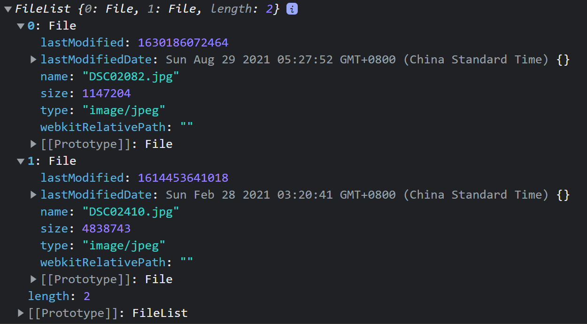

# API documentation

## Response definition

### Response for valid request

  ```json
  {
  "status": 1,
  "data": "<requested data>"
}
  ```

### Response for invalid request

  ```json
  {
  "status": 0,
  "code": "<error code>",
  "msg": "<reason for invalid request>"
}
  ```

## API list

### ./hello

For test purpose

* `./hello`
    * Method  `GET`
        * Request
            * `prefix`*: String, the people who say 'Hello world!'
        * Response
            * `data`: String, the message to display
        * Error code
            * `000`: Missing arguments
    * Method `POST`
        * Request
            * `name`*: String, username
            * `email`*: String: email
        * Response
            * `data`: String, the message to display
        * Error code
            * `000`: Missing arguments

### ./auth

* `./auth/user/login`: user log in
    * Method `POST`
        * Request
            * `email`*: String, the email user used to register
            * `password`*: String, user's password
        * Response
            * `data`
                * `username`*: String, username to display
                * `avatar`: String, url of the user's profile photo
        * Error code
            * `000`: Missing arguments
            * `001`: Incorrect password
            * `002`: Email not registered

* `./auth/user/logout`: user log out
    * Method `POST`
        * Request: None
        * Response
            * `data`: Empty string

* `./auth/staff/login`: staff log in
    * Method `POST`
        * Request
            * `email`*: String, the email staff used to register
            * `password`*: String, user's password
        * Response
            * `data`
                * `username`: String, username to display
                * `avatar`: String, url of the staff's profile photo
        * Error code
            * `000`: Missing arguments
            * `001`: Incorrect password
            * `002`: Email not registered

* `./auth/staff/logout`: staff log out
    * Method `POST`
        * Request: None
        * Response
            * `data`: Empty string

* `./auth/admin/login`: admin log in
    * Method `POST`
        * Request
            * `password`*: String, user's password
        * Response
            * `data`: Empty string
        * Error code
            * `000`: Missing arguments
            * `001`: Incorrect password

* `./auth/admin/logout`: admin log out
    * Method `POST`
        * Request: None
        * Response
            * `data`: Empty string
* `./auth/code`
    * Method: `POST`: generate a verification code for staff/user
        * Request:
            * `email`: the email to send to
        * Response
            * `data`: Empty string
        * Error code:
            * `000`: Missing arguments

### ./account

* `./account/user`
    * Method `POST`: add new user
        * Request
            * `username`*: String, nickname preferred by user
            * `email`*: String, email address, unique
            * `birthday`: String, date of birth, format 'YYYY-MM-DD'
            * `gender`: String, must in 'Male', 'Female', 'Other'
            * `bio`: String, an introduction of user
            * `avatar`: File, an img of user's avatar (Can be ignored in cycle 1)
            * `password*`: String, user's password
        * Response
            * `data`: Empty string
        * Error code
            * `000`: Missing arguments
            * `003`: Email already registered
            * `004`: Birthday format incorrect
            * `005`: Gender not valid
            * `006`: Avatar file not valid
            * `007`: Password not valid
    * Method `PUT`: update user info
        * Request
            * `username`: String, nickname preferred by user
            * `email`: String, email address, unique
            * `birthday`: String, date of birth, format 'YYYY-MM-DD'
            * `gender`: String, must in 'Male', 'Female', 'Other'
            * `bio`: String, an introduction of user
            * `avatar`: File, an img of user's avatar (Can be ignored in cycle 1)
            * `password`: String, user's password
            * `verification_code`: String, necessary if requests to change password
        * Response
            * `data`: Empty string
        * Error code
            * `000`: Missing arguments
            * `003`: Email already registered
            * `004`: Birthday format incorrect
            * `005`: Gender not valid
            * `006`: Avatar file not valid
            * `007`: Password not valid
            * `009`: Not logged in or not qualified
            * `010`: verification code not correct
    * Method `GET`: get one user info
        * Request: has at least 1 argument
            * `email`: email of the user
            * `user_id`: user_id
        * Response
            * `data`
                * `username`: String, nickname preferred by user
                * `email`: String, email address, unique
                * `birthday`: String, date of birth, format 'YYYY-MM-DD'
                * `gender`: String, must in 'Male', 'Female', 'Other'
                * `bio`: String, an introduction of user
                * `avatar`: File, an img of user's avatar (Can be ignored in cycle 1)
                * `user_id`: the id of the user
        * Error code
            * `000` Missing arguments
            * `008` No such user

* `./account/user/posts`: see **public** post of one user (different from `./posts/my`)
    * Method `GET`
        * Request
            * `user_id`: user_id
        * Response
            * `data`:  \<Same as type 2 response for `GET: ./posts`\>
        * Error code
            * `000` Missing arguments
            * `008` No such user

* `./account/user/addresses`
    * Method `GET`: get my addresses
        * Request: `None`
        * Response
            * `data`: a list of the following address
                * `address_id`: String, key (ID) of this address
                * `name`: String, receiver name (not username)
                * `phone`: String, user's phone
                * `address`: String, address information
        * Error code
            * `009`: Not logged in or not qualified
            *
    * Method `POST`: add a new address
        * Request
            * `name`: String, receiver name (not username)
            * `phone`: String, user's phone
            * `address`: String, address information
        * Response
            * `data`: an empty string
        * Error code
            * `000`: Missing arguments
            * `009`: Not logged in or not qualified
    * Method `PUT`: modify an existing address
        * Request
            * `address_id`: String, key (ID) of this address
            * `name`: String, receiver name (not username)
            * `phone`: String, user's phone
            * `address`: String, address information
        * Response
            * `data`: an empty string
        * Error code
            * `000`: Missing arguments
            * `009`: Not logged in or not qualified
    * Method `DELETE`: delete an existing address
        * Request
            * `address_id`: String, key (ID) of this address
        * Response
            * `data`: an empty string
        * Error code
            * `000`: Missing arguments
            * `009`: Not logged in or not qualified

* `./account/user/rates`
    * Method: `GET`: Get a summary of user's ratings, only visible ratings will show
    * Request:
        * `user_id`: int
    * Response:
        * `data`
          * `average_rate`: float, or NaN for no rates
          * `details`
            * A list of rate-comment-time pairs
              * `rate`: int
              * `comment`: String
              * `time`: String, %Y-%m-%d %H:%M
    * Error Code:
      * `000`: Missing arguments
      * `008`: No such user
* `./account/staff`: add new staff
    * Method `POST`
        * Request
            * `username`*: String, nickname preferred by user
            * `email`*: String, email address, unique
            * `birthday`: String, date of birth, format 'YYYY-MM-DD'
            * `gender`: String, must in 'Male', 'Female', 'Other'
            * `bio`: String, an introduction of user
            * `avatar`: File, an img of user's avatar (Can be ignored in cycle 1)
            * `password`*: String, user's password
        * Response
            * `data`: Empty string
        * Error code
            * `000`: Missing arguments
            * `003`: Email already registered
            * `004`: Birthday format incorrect
            * `005`: Gender not valid
            * `006`: Avatar file not valid
            * `007`: Password not valid
    * Method `PUT`: update staff info
        * Request
            * `username`: String, nickname preferred by user
            * `email`: String, email address, unique
            * `birthday`: String, date of birth, format 'YYYY-MM-DD'
            * `gender`: String, must in 'Male', 'Female', 'Other'
            * `bio`: String, an introduction of user
            * `avatar`: File, an img of user's avatar (Can be ignored in cycle 1)
            * `password`: String, user's password
            * `verification_code`: String, necessary if requests to change password
        * Response
            * `data`: Empty string
        * Error code
            * `000`: Missing arguments
            * `003`: Email already registered
            * `004`: Birthday format incorrect
            * `005`: Gender not valid
            * `006`: Avatar file not valid
            * `007`: Password not valid
            * `009`: Not logged in or not qualified
            * `010`: verification code not correct
    * Method `GET`: get one staff info
        * Request: has at least 1 argument
            * `email`: email of the staff
            * `staff_id`: staff_id
        * Response
            * `data`
                * `username`: String, nickname preferred by user
                * `email`: String, email address, unique
                * `birthday`: String, date of birth, format 'YYYY-MM-DD'
                * `gender`: String, must in 'Male', 'Female', 'Other'
                * `bio`: String, an introduction of user
                * `avatar`: File, an img of user's avatar (Can be ignored in cycle 1)
                * `staff_id`: the id of the staff
        * Error code
            * `000` Missing arguments
            * `008` No such staff

### ./posts

* `./posts`
    * Method `GET`: get one post **or** search for posts according to keywords
        * Request (type 1: get exactly one post by post_id)
            * `post_id`*: The original post id
        * Request (type 2: search for posts according to keywords)
            * `search`*: keyword to search, this could be something in the product title, or product description
        * Request (type 3: get posts for index): `None`
        * Response (type 1: get exactly one post by post_id)
            * `data`
                * `post_id`: int, The post id searched for
                * `post_title`: String, post title
                * `post_content`: String, The content of the post, entered by the user
                * `post_author_id`: String, Author's user_id
                * `post_author_username`: String, Author's username
                * `post_author_avatar`: String, Author's Avatar
                * `post_creation_time`: String, time of post creation, %Y-%m-%d %H:%M
                * `post_modification_time`: String, time of last modification, %Y-%m-%d %H:%M
                * `post_status`: int, {0: deleted, 1: visible to public, 2: private}
                * `post_product_status`: int, {0: sold, 1:for_sale}
                * `post_product_price`: float, .2f. The price the seller enters
                * `post_images`: list, \[String, String, String...\], the urls of images the seller uploaded
        * Response (type 2: search for posts according to keywords)
            * `data`: list, \[ \<post attributes same as Response type 1\>\]
        * Response (type 3: get posts for index)
            * `data`: list, \[ \<post attributes same as Response type 1\>\]
        * Error code
            * `000`: Missing arguments
            * `011`: The post does not exist or is deleted/hidden
    * Method `POST`: create new post
        * Request
            * `post_title`: String, post title
            * `post_content`: String, The content of the post, entered by the user
            * `post_status`: int, {1: visible to public, 2: private} (Cannot set to be {0: deleted} here)
            * `post_product_price`: float, .2f. The price the seller enters
            * `post_images`: list of File **If no images, pass [] to list**
        * Response (type 2: search for posts according to keywords)
            * `data`: Empty String
        * Error code
            * `000`: Missing arguments
            * `009`: Not logged in or not qualified
            * `014`: Invalid `post_status`
            * `015`: Invalid `post_product_price`
            * `006`: Invalid `post_images`
    * Method `PUT`: update existing post
        * Request
            * `post_id`: String, the original `post_id`
            * `post_title`: String, post title
            * `post_content`: String, The content of the post, entered by the user
            * `post_status`: int, {1: visible to public, 2: private} (Cannot set to be {0: deleted} here)
            * `post_product_price`: float, .2f. The price the seller enters
            * `post_images`: list of File (Can be ignored in cycle 2)
        * Response
            * `data`: Empty String
        * Error code
            * `000`: Missing arguments
            * `009`: Not logged in or not qualified
            * `014`: Invalid `post_status`
            * `015`: Invalid `post_product_price`
            * `006`: Invalid `post_images`
            * `016`: The post is locked because product already sold or post already deleted
    * Method `DELETE`: delete existing post
        * Request
            * `post_id`: String, the original `post_id`
        * Response
            * `data`: Empty String
        * Error code
            * `000`: Missing arguments
            * `009`: Not logged in or not qualified
            * `016`: The post is locked because product already sold
            * `017`: The post is already deleted
* `./posts/my`
    * Method `GET`: user's posts. **Note: must log in to see my posts, including both private and public ones**,
      different from `./account/user/posts`
        * Request
            * `None`
        * Response
            * `data`: \<Same as type 2 response for `GET: ./posts`\>

### ./deal

#### How does a deal work?

1. Deal was originally a post
2. Buyer calls `POST ./deal` to convert the original post to a deal, and lock the post. This is defined as "buy", the
   original post is marked "sold out"
3. Seller can enter the express tracking number, or cancel the deal
    1. If the deal is cancelled, then the post resumes
    2. If express tracking number is entered, go to step 4
4. Buyer can click "confirm", or, after 10 days, the deal will confirm automatically

**Cancel Policy**

In the following stats, each role has different permissions to cancel the order or not

| State            | Staff | Seller | Buyer |
|------------------|-------|--------|-------|
| Unpaid           | TRUE  | TRUE   | TRUE  |
| Shipment pending | TRUE  | TRUE   | TRUE  |
| Delivering       | TRUE  | TRUE   | FALSE |
| Deal finished    | TRUE  | FALSE  | FALSE |
| Cancelled        | FALSE | FALSE  | FALSE |

#### APIs

* `./deal`
    * Method `GET`: get the details of the deal (user need to be either staff, buyer, or seller)
        * Request
            * `deal_id`: int
        * Response
            * `data`
                * `deal_id`: int
                * `post_id`: int, which can link to the post
                * `seller_id`: int, user_id of the seller
                * `buyer_id`: int, user_id of the buyer
                * `price`: float (.2f), the price paid, which cannot be modified once the deal is created
                * `ststus`: String, one from {"Unpaid", "Shipment pending", "Delivering","Deal finished", "Cancelled
                  by ***" (seller, buyer, staff)}
                * `buyer_address`: where the package sent to
                * `buyer_phone`
                * `buyer_name`
                * `order_trace`: a list of key-value pair of the trace of the deal events. For example:
                   ```json
                   [
                       {"time": "2021-11-20 10:25:17", "status": "Buyer paid 340.18$"},
                       {"time": "2021-11-20 16:25:36", "status": "Seller sent out package, track id: JD00002262"},
                       {"time": "2021-11-23 18:07:28", "status": "Deal finished"}
                   ]
                   ```
        * Error code
            * `000`: Missing arguments
            * `009`: Not qualified
    * Method `POST`: create a new post using `post_id`. Note: we assume the buyer is paid by calling this API
        * Request
            * `post_id`: int
            * `buyer_address`: String
            * `buyer_phone`: String
            * `buyer_name`: String
        * Response
            * `data`
                * `deal_id`: int, the newly generated deal_id
        * Error code
            * `000`: Missing arguments
            * `009`: Not logged in or qualified
            * `011`: The post does not exist or is deleted/hidden
            * `021`: Post status does not allow itself to be turned into a deal
    * Method `PUT`: either adding an express tracking number, or confirm receipt
        * Request 1: add/update an express tracking number
            * `action`: `"express"`
            * `deal_id`: int
            * `code`: int, the express tracking number
        * Request 2: confirm receipt
            * `action`: `"confirm"`
            * `deal_id`: int
        * Response
            * `data`:`""`
        * Error code
            * `000`: Missing arguments
            * `009`: Do not have access to this feature
            * `018`: Receipt already confirmed
            * `022`: Invalid action attribute
            * `024`: Deal does not exist
    * Method `DELETE`: cancel the order
        * Request
            * `deal_id`: int, the deal which is going to cancel
            * `reason`: str, why to cancel the deal
        * Response
            * `data`: `""`
        * Error code
            * `009`: Not logged in or not qualified
            * `019`: (For buyer) Package has sent out, can not cancel
            * `020`: Receipt is confirmed, can not cancel
            * `024`: Deal does not exist
            * `025`: Deal already cancelled
            * `026`: Deal already finished, seller cannot cancel
            * `027`: Deal already finished, buyer cannot cancel
            * `028`: Deal in delivering, buyer cannot cancel
* `/deal/rate`
    * Method `GET`
        * Request:
            * `deal_id`: int
        * Response
            * `data`:
                * `buyer_rate`: int
                * `buyer_comment`: String
                * `buyer_rate_time`: String, %Y-%m-%d %H:%M
                * `seller_rate`: int
                * `seller_comment`: int
                * `seller_rate_time`: String, %Y-%m-%d %H:%M
        * Error Code
          * `000`: Missing arguments
          * `009`: Not logged in
          * `029`: Not your deal, cannot view
          * `030`: Seller and buyer haven't both finished rating, rate not visible
    * Method `POST`
        * Request:
            * `deal_id`: int
            * `rate`: int, from {1, 2, 3, 4, 5}
            * `comment`: String
        * Response
            * `data`: `""`
        * Error Code
          * `000`: Missing arguments
          * `009`: Not logged in
          * `029`: Not your deal, cannot view
          * `031`: Rate already exists
          * `032`: rate not valid
* `/deal/my`
    * Method `GET`: Get my sold and bought deals
    * Request: None
    * Response:
        * `data`: a list of dictionaries with the same format of `GET ./deal`
    * Error Code:
        * `009`: Not logged in as a user
* `/deal/my/sold`
    * Method `GET`: Get my sold deals
    * Request: None
    * Response:
        * `data`: a list of dictionaries with the same format of `GET ./deal`
    * Error Code:
        * `009`: Not logged in as a user
* `/deal/my/bought`
    * Method `GET`: Get my bought deals
    * Request: None
    * Response:
        * `data`: a list of dictionaries with the same format of `GET ./deal`
    * Error Code:
        * `009`: Not logged in as a user

### ./image

#### How does an image work?

1. Frontend uploads an image
2. Backend returns the url of this image
3. Frontend can `GET` this image using the url

For image upload demo, see [image_demo](../backend/image_demo) in directory `backend`


#### APIs

* `./image`
    * Method `POST`: upload image
        * Request
            * `image`: a JavaScript `FileList` object. For example:
              
        * Response
            * `data`
                * `urls`: `[url1, url2, ...]` a list of urls corresponding to each image
        * Error code
            * `000`: Missing arguments
            * `net::ERR_CONNECTION_ABORTED`: Upload interrupted, may be caused by not logged in.
            * `022`: File extension not accepted
* `/image/{image sub url}`
    * Method `GET`
        * Request: `None`
        * Response: the image
        * Error code: `404` (default http request code)
    * Method `DELETE`: delete image
        * Request: `None`
        * Response
            * `data`: `""`
        * Error code
            * `021`: image doesn't exist
            * `009`: Not qualified to delete this image


